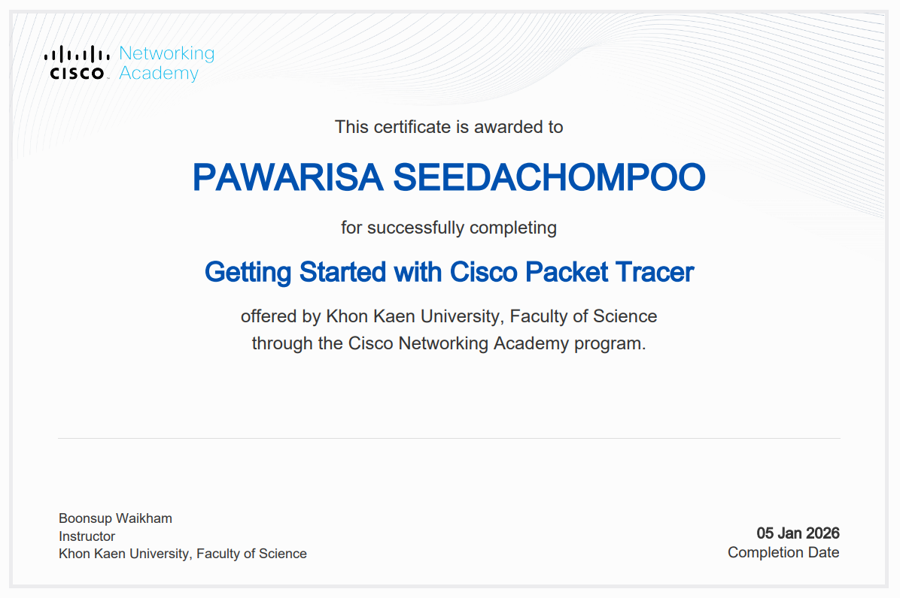

Personal Portfolio — Network & Systems 2025–2026
---

Assignments
| # | ชื่องาน| ไฟล์ / ลิงก์ |
|---|---------|--------------|
| 01 | Essay Link | [View](./Assignments/Assignment1.pdf) |
| 02 | Topology | [View](./Assignments/Assignment2.pdf) |
| 03 | Not_Simple | [View](./Assignments/Assignment3.pdf) |
| 04 | TCP-UDP | [View](./Assignments/Assignment4.pdf) |
| 05 | New Network | [View](./Assignments/New_Network.pdf) |

---

Lab Reports
| # | ชื่อ Lab | ไฟล์ / ลิงก์ |
|---|----------|--------------|
| LAB 1 | Lab Report 1 | [View](./Labs/Lab_1.pdf) |
| LAB 2 | Lab Report 2 | [View](./Labs/Lab_2.pdf) |
| LAB 3 | Lab Report 3 | [View](./Labs/Lab_3.pdf) |
| LAB 4 | Lab Report 4 | [View](./Labs/LAB_4.pdf) |
| LAB 5 | Lab Report 5 | [View](./Labs/LAB_5.pdf) |
| LAB 6 | Lab Report 6 | [View](./Labs/LAB_6.pdf) |
| LAB 7 | Lab Report 7 | [View](./Labs/LAB_7.pdf) |

---

Final Project
| ชื่อ | ไฟล์ / ลิงก์ |
|------|--------------|
| Final Project Artifacts | [View]((https://github.com/pawarisa-13/Magnetic-Resonance-Network-MRN-)) |

---

Certificate Gallery
<table>
  <tr>
    <td align="center" width="50%">
      
    </td>
  </tr>
</table>

---

  Network & Systems Portfolio · 2025–2026

 
